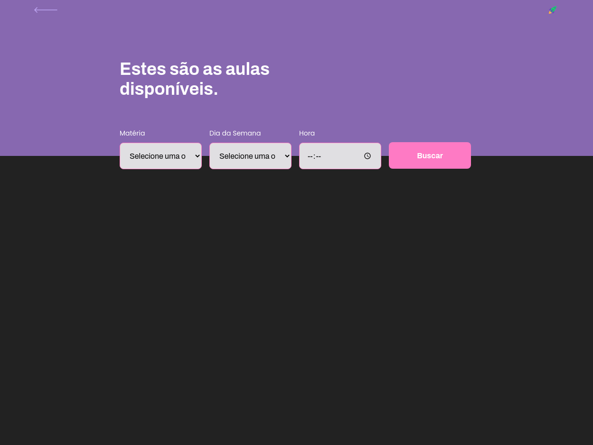
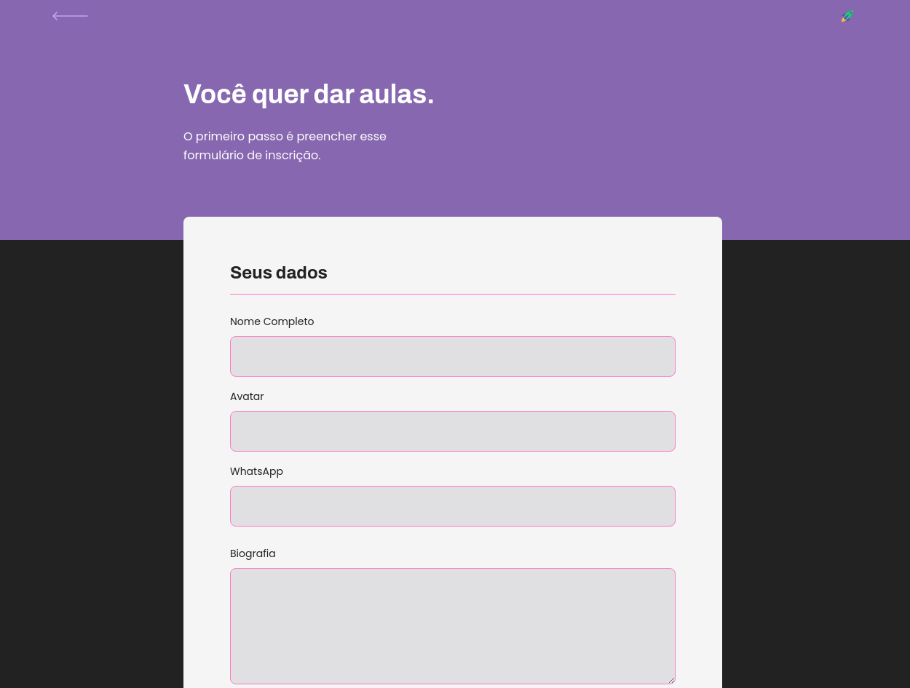
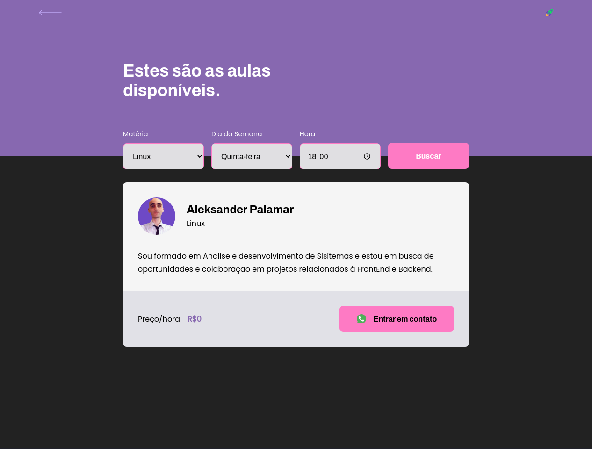

<h1 align="center">
    Rocket<br> 
</h1>
<div align="center">
     
    
    
      
</div>
    
<p align="center">   
    
</p>
<p align="center">
  <a href="#sobre">Sobre</a>&nbsp;&nbsp;&nbsp;|&nbsp;&nbsp;&nbsp;
  <a href="#tecnologias">Tecnologias</a>&nbsp;&nbsp;&nbsp;|&nbsp;&nbsp;&nbsp;
  <a href="#como-executar">Como Executar</a>&nbsp;&nbsp;&nbsp;|&nbsp;&nbsp;&nbsp;
  <a href="#licença">Licença</a>
</p>

## Sobre

O **Rocket** é uma aplicação Web feita para auxiliar na conexão entre os alunos e os professores. Logo, esta aplicação oferece aos professores a possibilidade de registrar aulas, podendo adicionar informações como a disciplina, o custo e horário e aos alunos a possibilidade de buscar pelas aulas cadastradas.

## Tecnologias

-  [Typescript](https://www.typescriptlang.org/)
-  [Node.js](https://nodejs.org/en/)
-  [ReactJS](https://reactjs.org/)
-  [Expo](https://expo.io/)
-  [Express](https://expressjs.com/)
-  [axios](https://github.com/axios/axios)

## Como Executar

- ### **Pré-requisitos**

  - É **necessário** possuir o **[Node.js](https://nodejs.org/en/)** instalado no computador
  - É **necessário** possuir o **[Git](https://git-scm.com/)** instalado e configurado no computador
  - Também, é **preciso** ter um gerenciador de pacotes seja o **[NPM](https://www.npmjs.com/)** ou **[Yarn](https://yarnpkg.com/)**.
  - Por fim, é **essencial** ter o **[Expo](https://expo.io/)** instalado de forma global na máquina

1. Faça um clone do repositório:

```sh
  $ git remote add origin https://github.com/aleksanderpalamar/Rocket.git
```

2. Executando a Aplicação:

```sh
  # API
  $ cd backend
  # Instalando as dependências do projeto.
  $ yarn # ou npm install
  # Configurando o banco de dados e criando as tabelas.
  $ yarn knex:migrate # ou npm run knex:migrate

  # Inicie a API
  $ yarn start # ou npm start

  # Aplicação web
  $ cd frontend
  # Instalando as dependências do projeto.
  $ yarn # ou npm install
  # Inicie a aplicação web
  $ yarn start # ou npm start
```

---
<sup>Projeto desenvolvido por [Aleksander Palamar](https://github.com/aleksanderpalamar), da [Blog](https://app.linuxupdate.com.br).</sup>
